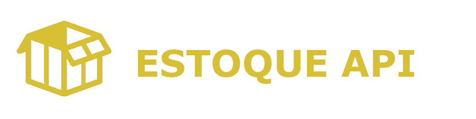
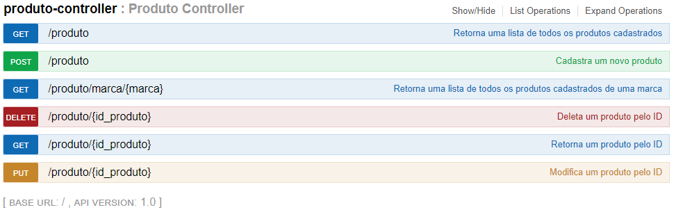

<h1 align="center">Estoque API REST</h1>

Concluído :rocket: 

  <a href="#Sobre">Sobre</a> •
  <a href="#Funcionalidades">Funcionalidades</a> •
  <a href="#Executar">Como Executar</a> •
  <a href="#Tecnologias">Tecnologias</a> •
  <a href="#Autor">Autor</a> •
  <a href="#Licenca">Licença</a>

<h2 id="Sobre">:computer: Sobre o projeto</h2>

  📦 Estoque API REST: Um projeto backend com o propósito de organizar e controlar os produtos de um mercado a fim de facilitar o trabalho   dos colaboradores do estabelecimento.

  Esse projeto foi desenvolvido principalmente para que o Autor pudesse praticar as tecnologias de backend e assim explorar cada vez mais esse mundo da programação.

<h2 id="Funcionalidades">⚙️ Funcionalidades</h2>

  - [x] Cadastrar produto
  - [x] Consultar produto pelo ID
  - [x] Consultar produtos de uma marca
  - [x] Consultar todos os produtos do estoque
  - [x] Alterar produto
  - [x] Deletar produto

Endpoints para as funcionalidades: 

<h2 id="Executar">🚀 Como executar o projeto</h2>

Você pode executar e testar a aplicação acessando o swagger do meu projeto no meu heroku clicando <a href="https://estoqueapirest.herokuapp.com/swagger-ui.html#/produto45controller">aqui</a>

Caso você queira usar o Postman para testar o projeto basta usar a url: https://estoqueapirest.herokuapp.com

